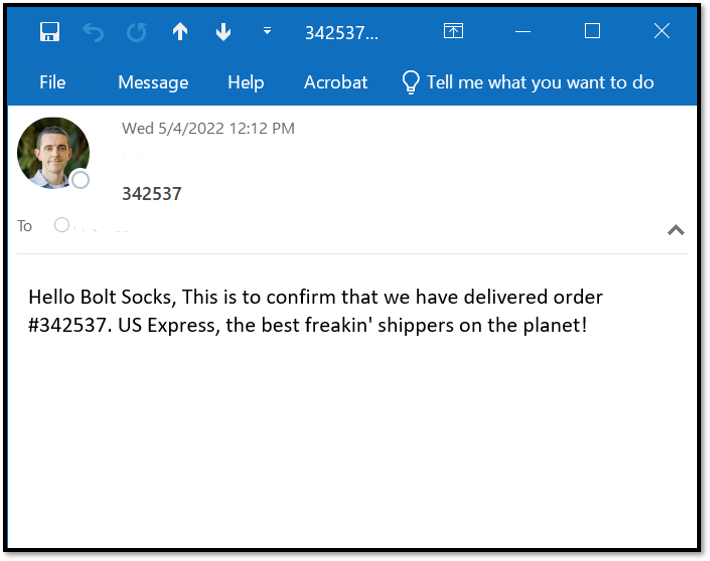

# 🚀 BoltInvoices – Automating Invoicing in the Order-to-Cash Cycle

This project highlights how I used **process mining** (Celonis), **process mapping** (Lucidchart), and **RPA** (UiPath) to streamline and automate the invoicing step in the Order-to-Cash process for Bolt Socks.

> 📉 I discovered that invoice creation was often delayed by more than a day after delivery confirmation. By automating this step using UiPath, I eliminated the delay, saved manual effort, and improved the overall throughput performance of the process.

---

## 🔍 Problem Statement

- **Issue Identified:** Manual invoice creation often occurred >1 day after delivery confirmation.
- **Impact:** Delayed cash flow, lower throughput target achievement, and increased administrative burden.
- **Opportunity:** Automate invoice generation and dispatch once delivery confirmation is received.

---

## 🔬 Process Discovery with Celonis

Using **Celonis Business Miner**, I analyzed over 5,000 Order-to-Cash cases. Key findings:

- ⏱️ **Median Throughput Time:** 23.6 days  
- 🎯 **Target Throughput:** 23 days  
- ⚠️ **Target Hit Rate:** 49%  

> The delay between **"Confirmed Delivery"** and **"Invoice Created"** emerged as a key bottleneck.

### Visual Insights:
 
 
 
 

---

## 🗺️ Mapping with Lucidchart

I used **Lucidchart** to map out the full Order-to-Cash process, identifying automation points and separating human vs. system activities.

[Lucidchart Process Map](Order%20to%20Cash.pdf)

---

## 🤖 UiPath RPA Project: "BoltInvoices"

I built a UiPath bot to automatically generate and email invoices as soon as a delivery confirmation email is received in Outlook.

### 🧠 Bot Logic

1. Open [Orders.xlsx](./Orders.xlsx)
2. Connect to Outlook 365
3. Check for unread emails
   
4. If a confirmation is found:
   - Fill the invoice template with:
     - Order info
     - Today’s date
     - Due date (+30 days)
     - Amount from order file
       
   
   
   - Save invoice as PDF (filename includes Order ID)
   - Email invoice PDF to customer
     
   - Move email to “RPA” folder and mark it as read
   - Log processed order using `Write Line`    
     [Output](./output-3.txt)

---

## 🛠 Tools & Technologies

- UiPath Studio
- Outlook 365 Activities
- Excel + Word Automation
- File System Automation
- Celonis Business Miner
- Lucidchart for process visualization

---

## 📁 Repository Contents

- [Orders.xlsx](./Orders.xlsx) — Sample order data
-  - Sample email for Delivery Confirmation  
-  — Invoice with dynamic placeholders  
- [Lucidchart Process Map](Order%20to%20Cash.pdf) — Original business process - Lucidchart process flow 
- [Script](./Main.xaml) — UiPath automation script  
- Screenshots from Celonis  

---

## ✅ Outcome

- Reduced invoice creation time from 1 day to **real-time**
- Improved target throughput compliance
- Fully automated, error-free invoice generation and dispatch
- Easier tracking with centralized PDF storage and logging

---

